# ComerGeneralized2024 — MLIP 吸着エネルギーベンチマーク結果

## ベンチマーク概要

**ComerGeneralized2024** は、金属酸化物表面上の吸着反応に対する DFT 参照吸着エネルギーの
データセットで、吸着種は **O\*** と **OH\*** の 2 種・計 **325 反応**です
（出典: [CatBench](https://catbench.org/?dataset=ComerGeneralized2024) / Zenodo）。
本ページは、機械学習原子間ポテンシャル (MLIP) が予測する吸着エネルギーを DFT と比較し、
精度・頑健性・計算コストを評価した結果です（**23 calculator/variant** を比較）。

- 比較した calculator: UMA(fairchem), SevenNet(7net-omni, 各 modal), MatterSim, CHGNet, NequIP-OAM
- 末尾 **`-cueq`** は SevenNet の **CuEquivariance** 高速化版（モデル自体は同一＝精度同等、推論が高速）
- 計算条件: `mode=basic`（構造緩和）, `n_seeds=3`, `f_crit_relax=0.05`

### 指標の意味

| 指標 | 説明 |
|---|---|
| MAE_total (eV) | 全反応での予測 vs DFT 吸着エネルギーの平均絶対誤差 |
| MAE_normal (eV) | anomaly・吸着種 migration を除いた正常反応のみの MAE |
| Normal rate (%) | 正常に分類された反応の割合（高いほど頑健） |
| Anomaly rate (%) | エネルギー異常・非物理緩和・再現失敗の割合（低いほど良い） |
| ADwT / AMDwT (%) | しきい値内に収まる予測の割合（高いほど良い） |
| Time per step (s) | 1 最適化ステップあたりの計算時間（低いほど速い） |

## 全体比較

### 指標ヒートマップ表

各列を viridis で独立に正規化し、**明るい（黄色）ほど高性能**になるよう色付けしています
（MAE・時間など小さいほど良い指標は反転）。セル内は実数値です。

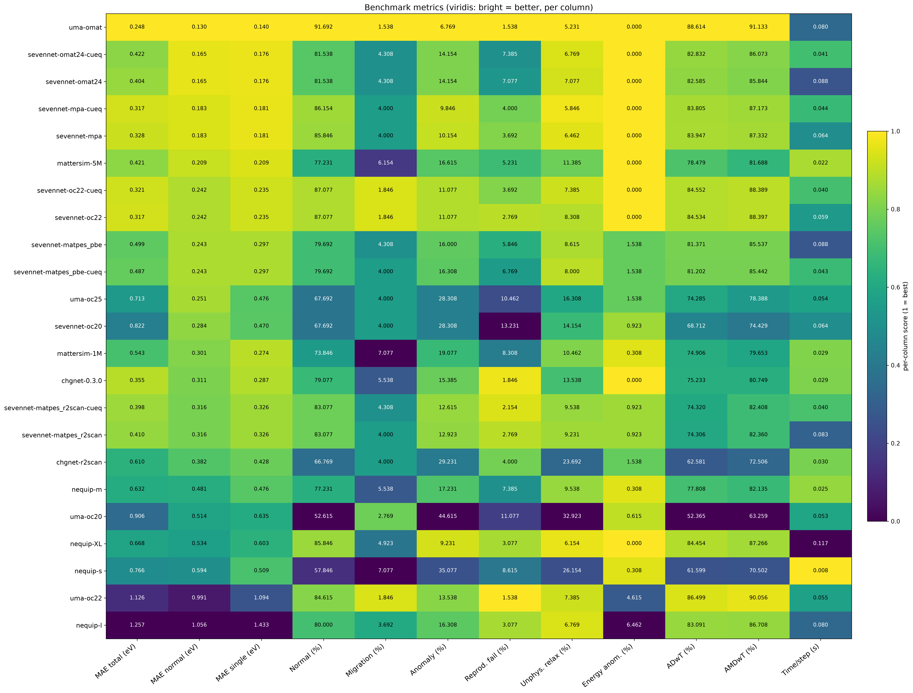

### 単一指標ランキング（棒グラフ）

MAE_total / MAE_normal / Time per step を **良い順（小さいほど上）** に並べた横棒グラフです。
viridis カラーバーで、**明るいほど高性能（低い値）** を表します。

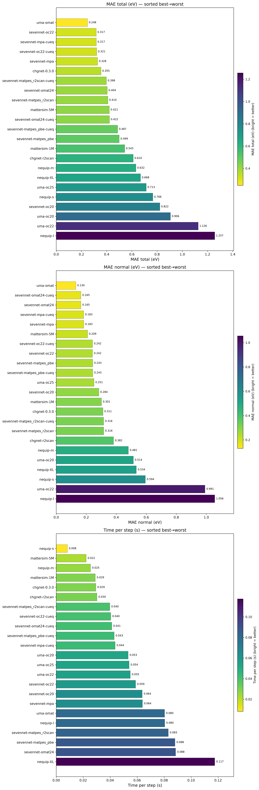

### Pareto 散布図（精度・頑健性 vs 計算コスト）

左から「Time/step vs MAE_total」「Time/step vs MAE_normal」「Time/step vs Normal rate」。
**左下（低コスト・低 MAE）** ほど精度効率が良く、Normal rate は **左上** ほど頑健かつ高速です。
点の色は MAE_total（明るいほど低 MAE＝良い）。

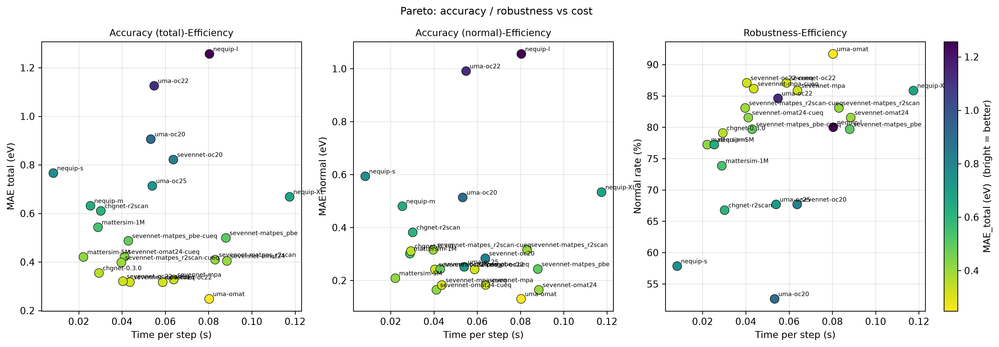

> インタラクティブ版: [`analysis/ComerGeneralized2024_dashboard.html`](analysis/ComerGeneralized2024_dashboard.html)

### サマリ表（MAE_normal 昇順）

| # | MLIP | MAE_total (eV) | MAE_normal (eV) | Normal (%) | ADwT (%) | AMDwT (%) | Time/step (s) |
|---:|---|---:|---:|---:|---:|---:|---:|
| 1 | uma-omat | 0.248 | 0.130 | 91.692 | 88.614 | 91.133 | 0.080 |
| 2 | sevennet-omat24-cueq | 0.422 | 0.165 | 81.538 | 82.832 | 86.073 | 0.041 |
| 3 | sevennet-omat24 | 0.404 | 0.165 | 81.538 | 82.585 | 85.844 | 0.088 |
| 4 | sevennet-mpa-cueq | 0.317 | 0.183 | 86.154 | 83.805 | 87.173 | 0.044 |
| 5 | sevennet-mpa | 0.328 | 0.183 | 85.846 | 83.947 | 87.332 | 0.064 |
| 6 | mattersim-5M | 0.421 | 0.209 | 77.231 | 78.479 | 81.688 | 0.022 |
| 7 | sevennet-oc22-cueq | 0.321 | 0.242 | 87.077 | 84.552 | 88.389 | 0.040 |
| 8 | sevennet-oc22 | 0.317 | 0.242 | 87.077 | 84.534 | 88.397 | 0.059 |
| 9 | sevennet-matpes_pbe | 0.499 | 0.243 | 79.692 | 81.371 | 85.537 | 0.088 |
| 10 | sevennet-matpes_pbe-cueq | 0.487 | 0.243 | 79.692 | 81.202 | 85.442 | 0.043 |
| 11 | uma-oc25 | 0.713 | 0.251 | 67.692 | 74.285 | 78.388 | 0.054 |
| 12 | sevennet-oc20 | 0.822 | 0.284 | 67.692 | 68.712 | 74.429 | 0.064 |
| 13 | mattersim-1M | 0.543 | 0.301 | 73.846 | 74.906 | 79.653 | 0.029 |
| 14 | chgnet-0.3.0 | 0.355 | 0.311 | 79.077 | 75.233 | 80.749 | 0.029 |
| 15 | sevennet-matpes_r2scan-cueq | 0.398 | 0.316 | 83.077 | 74.320 | 82.408 | 0.040 |
| 16 | sevennet-matpes_r2scan | 0.410 | 0.316 | 83.077 | 74.306 | 82.360 | 0.083 |
| 17 | chgnet-r2scan | 0.610 | 0.382 | 66.769 | 62.581 | 72.506 | 0.030 |
| 18 | nequip-m | 0.632 | 0.481 | 77.231 | 77.808 | 82.135 | 0.025 |
| 19 | uma-oc20 | 0.906 | 0.514 | 52.615 | 52.365 | 63.259 | 0.053 |
| 20 | nequip-XL | 0.668 | 0.534 | 85.846 | 84.454 | 87.266 | 0.117 |
| 21 | nequip-s | 0.766 | 0.594 | 57.846 | 61.599 | 70.502 | 0.008 |
| 22 | uma-oc22 | 1.126 | 0.991 | 84.615 | 86.499 | 90.056 | 0.055 |
| 23 | nequip-l | 1.257 | 1.056 | 80.000 | 83.091 | 86.708 | 0.080 |

### 主な結果

- **最高精度**: `uma-omat`（MAE_normal = 0.130 eV, MAE_total = 0.248 eV）。
- **最低精度**: `nequip-l`（MAE_normal = 1.056 eV）。
- **最速**: `nequip-s`（0.008 s/step）。
- **CuEquivariance の効果**: 精度はほぼ同等で推論が高速化（`sevennet-omat24` 0.088s (MAE 0.165) → `sevennet-omat24-cueq` 0.041s (MAE 0.165); `sevennet-mpa` 0.064s (MAE 0.183) → `sevennet-mpa-cueq` 0.044s (MAE 0.183)）。
- 本データセット（酸化物 O/OH）では SevenNet の `omat24`/`mpa` modal、UMA の `omat` task が良好でした。

## 各計算機の詳細 parity 図（予測 vs DFT）

左 = Total（全反応）, 右 = Normal（anomaly/migration 除外）。点は吸着種（O / OH）で色分け、
破線は y=x。Normal/anomaly の分類は CatBench 本体の分類器に準拠しています。

### 1. uma-omat

MAE_total = 0.248 eV / MAE_normal = 0.130 eV / Normal = 91.692 %

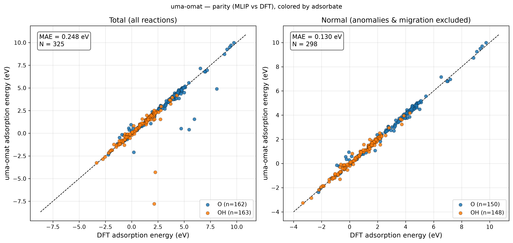

### 2. sevennet-omat24-cueq

MAE_total = 0.422 eV / MAE_normal = 0.165 eV / Normal = 81.538 %

### 3. sevennet-omat24

MAE_total = 0.404 eV / MAE_normal = 0.165 eV / Normal = 81.538 %

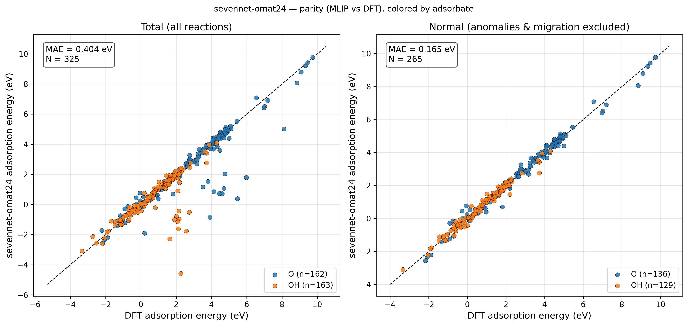

### 4. sevennet-mpa-cueq

MAE_total = 0.317 eV / MAE_normal = 0.183 eV / Normal = 86.154 %

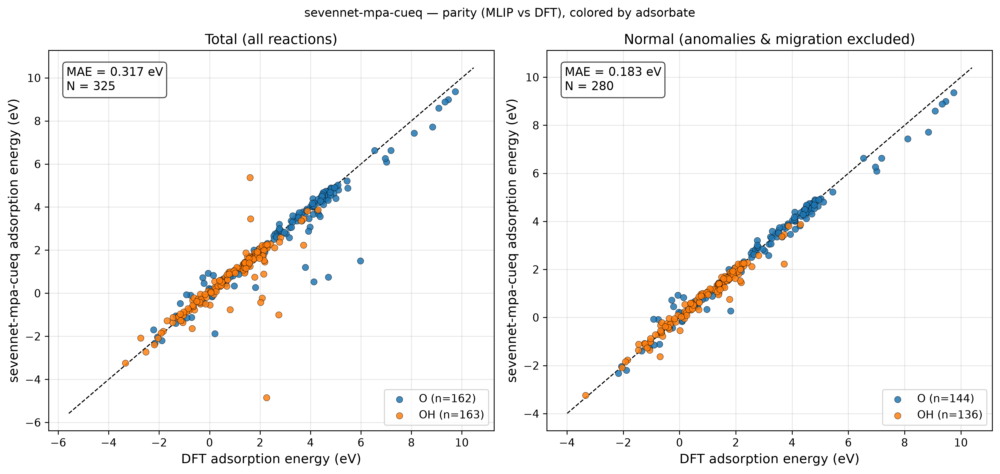

### 5. sevennet-mpa

MAE_total = 0.328 eV / MAE_normal = 0.183 eV / Normal = 85.846 %

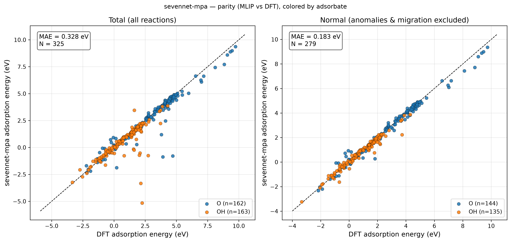

### 6. mattersim-5M

MAE_total = 0.421 eV / MAE_normal = 0.209 eV / Normal = 77.231 %

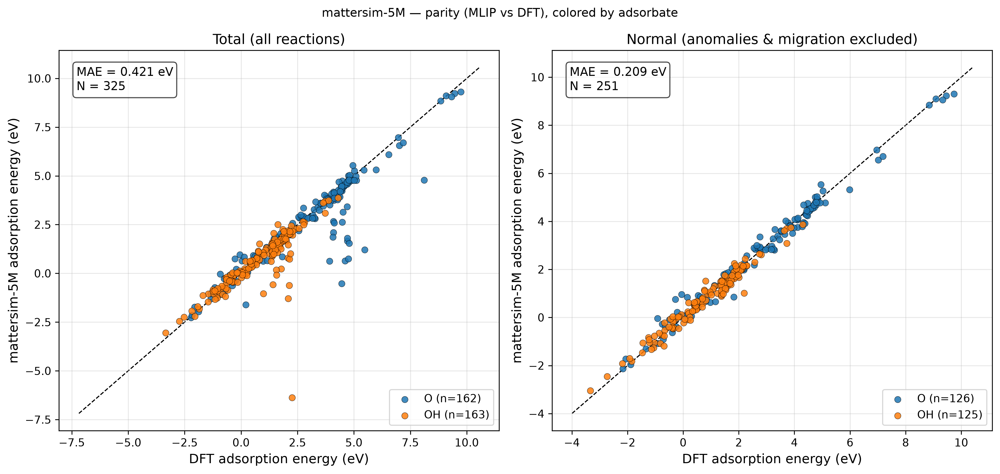

### 7. sevennet-oc22-cueq

MAE_total = 0.321 eV / MAE_normal = 0.242 eV / Normal = 87.077 %

### 8. sevennet-oc22

MAE_total = 0.317 eV / MAE_normal = 0.242 eV / Normal = 87.077 %

### 9. sevennet-matpes_pbe

MAE_total = 0.499 eV / MAE_normal = 0.243 eV / Normal = 79.692 %

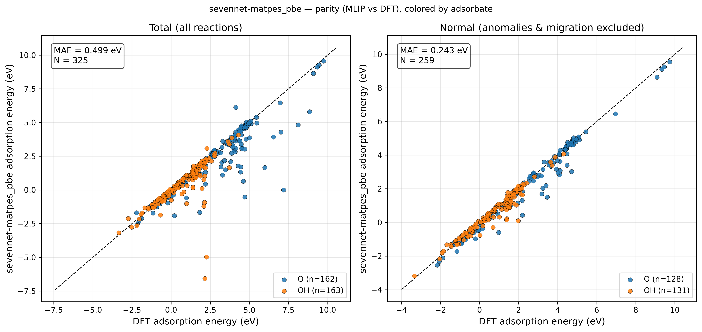

### 10. sevennet-matpes_pbe-cueq

MAE_total = 0.487 eV / MAE_normal = 0.243 eV / Normal = 79.692 %

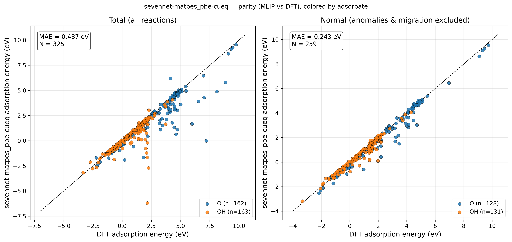

### 11. uma-oc25

MAE_total = 0.713 eV / MAE_normal = 0.251 eV / Normal = 67.692 %

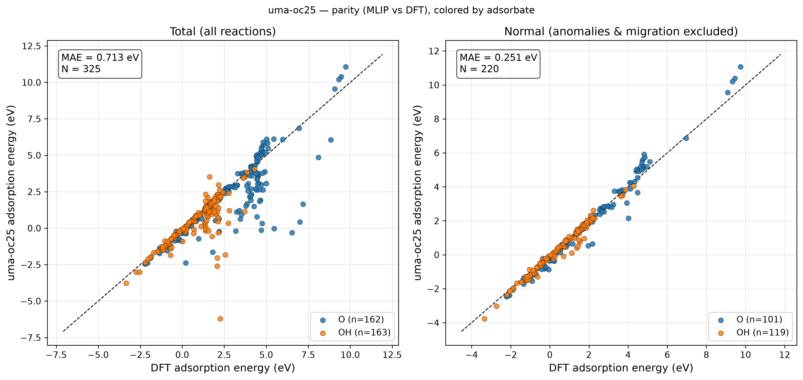

### 12. sevennet-oc20

MAE_total = 0.822 eV / MAE_normal = 0.284 eV / Normal = 67.692 %

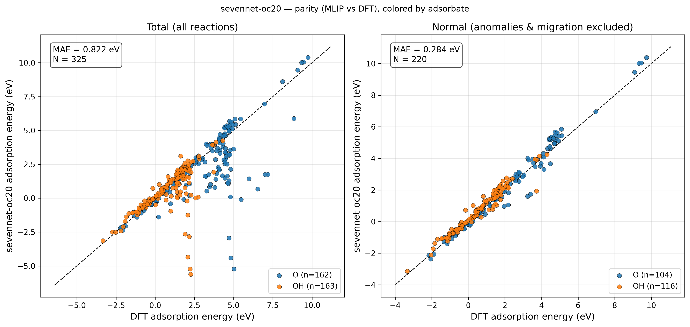

### 13. mattersim-1M

MAE_total = 0.543 eV / MAE_normal = 0.301 eV / Normal = 73.846 %

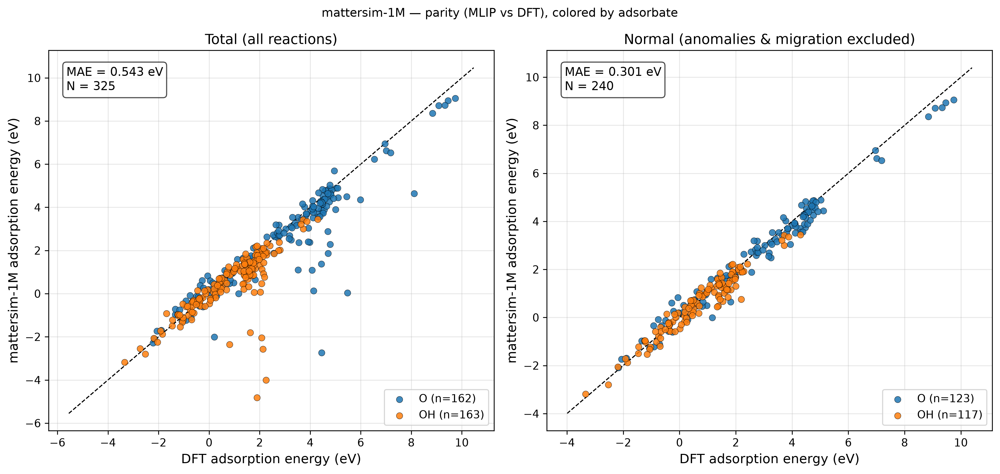

### 14. chgnet-0.3.0

MAE_total = 0.355 eV / MAE_normal = 0.311 eV / Normal = 79.077 %

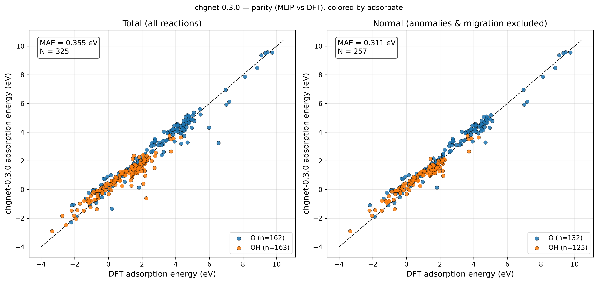

### 15. sevennet-matpes_r2scan-cueq

MAE_total = 0.398 eV / MAE_normal = 0.316 eV / Normal = 83.077 %

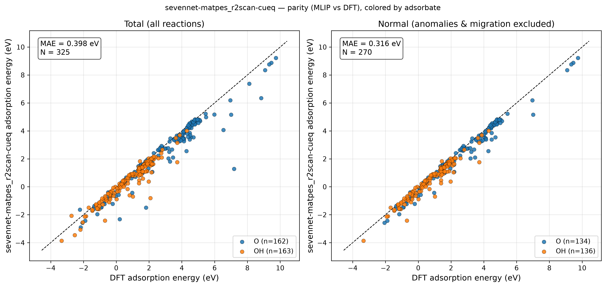

### 16. sevennet-matpes_r2scan

MAE_total = 0.410 eV / MAE_normal = 0.316 eV / Normal = 83.077 %

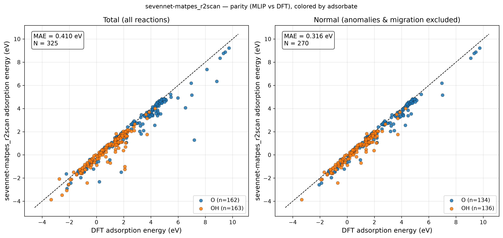

### 17. chgnet-r2scan

MAE_total = 0.610 eV / MAE_normal = 0.382 eV / Normal = 66.769 %

### 18. nequip-m

MAE_total = 0.632 eV / MAE_normal = 0.481 eV / Normal = 77.231 %

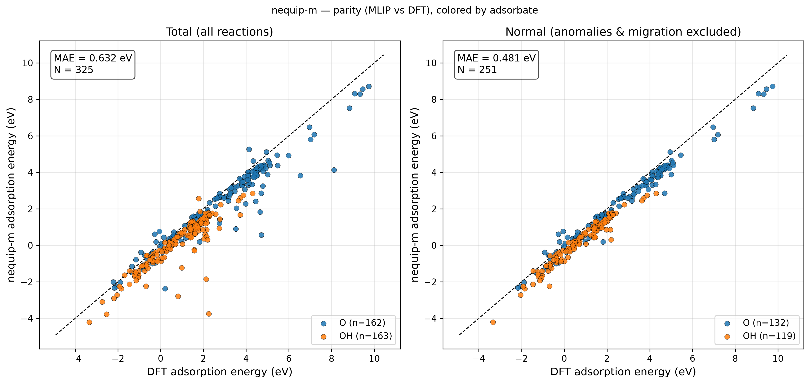

### 19. uma-oc20

MAE_total = 0.906 eV / MAE_normal = 0.514 eV / Normal = 52.615 %

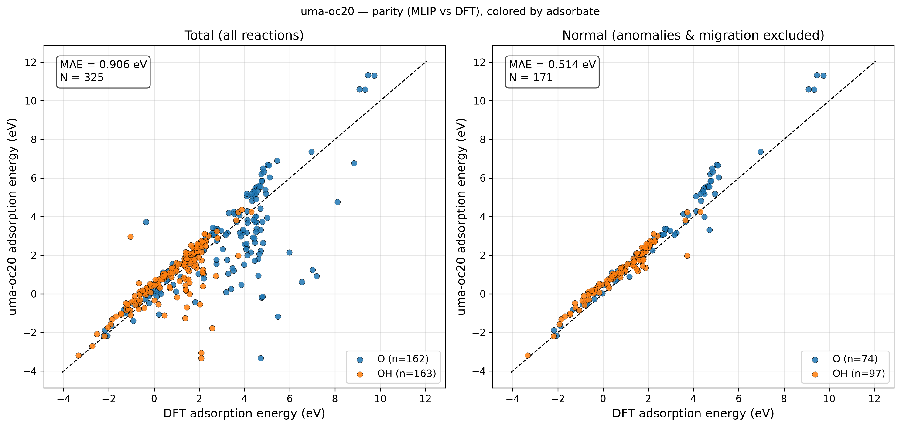

### 20. nequip-XL

MAE_total = 0.668 eV / MAE_normal = 0.534 eV / Normal = 85.846 %

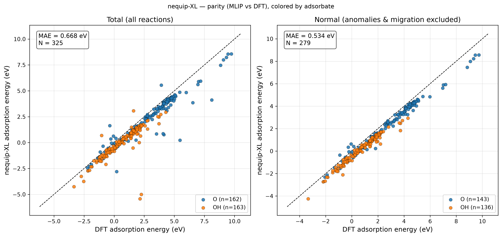

### 21. nequip-s

MAE_total = 0.766 eV / MAE_normal = 0.594 eV / Normal = 57.846 %

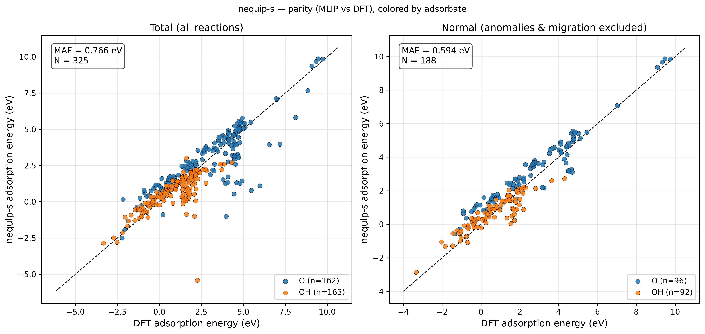

### 22. uma-oc22

MAE_total = 1.126 eV / MAE_normal = 0.991 eV / Normal = 84.615 %

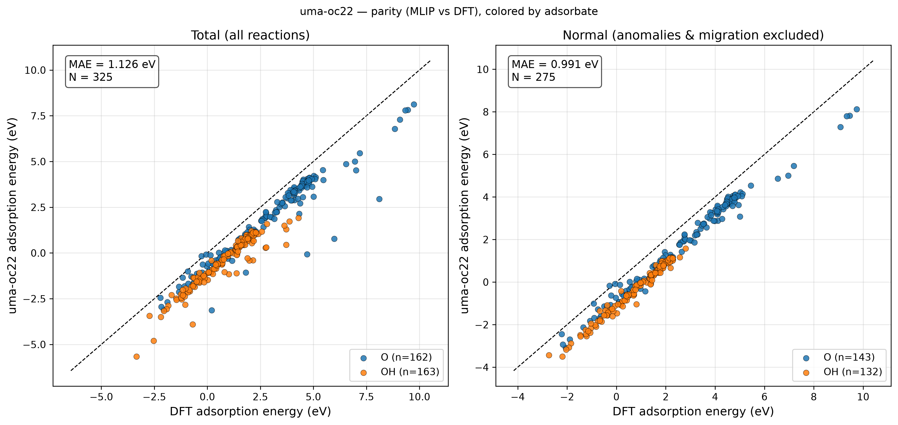

### 23. nequip-l

MAE_total = 1.257 eV / MAE_normal = 1.056 eV / Normal = 80.000 %

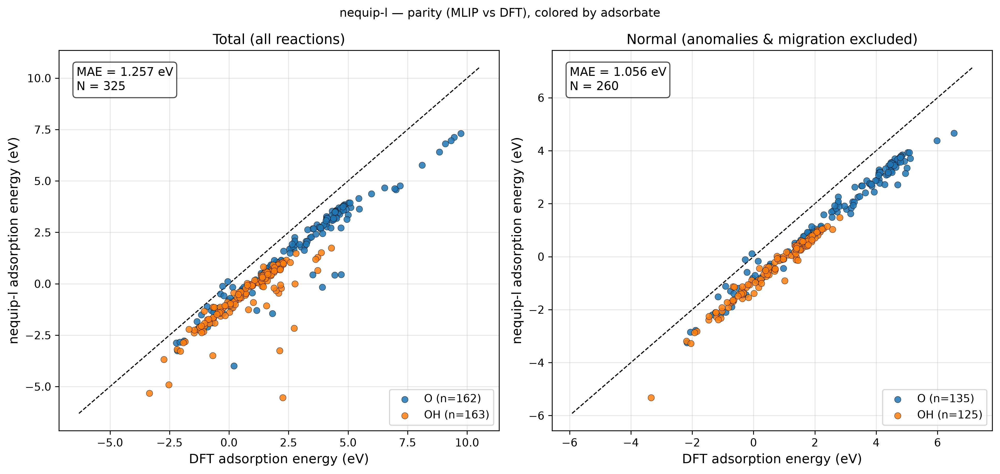
