# FG_dataset — MLIP 吸着エネルギーベンチマーク結果（分散力補正 D3 付き）

## ベンチマーク概要

**FG_dataset** は、**官能基を持つ有機分子**を各種金属表面に吸着させた反応に対する
DFT 参照吸着エネルギーのデータセットで、計 **2,651 反応**です
（reaction key 例: `group4_au_4821`, `amidines_os_4aZc` = `<官能基系>_<金属>_<id>`。
出典: [CatBench](https://catbench.org/?dataset=FG_dataset) / Zenodo）。
吸着分子は **11 系統**の官能基ファミリで、**芳香族系（`aromatics` / `aromatics2`）** のほか、
アミド（`amides`）・アミジン（`amidines`）・カルバメート（`carbamate`）・オキシム（`oximes`）・
`group2` / `group2b` / `group3N` / `group3S` / `group4` などを含みます。ComerGeneralized2024 の
小分子（O\*/OH\*）吸着に比べ**分子が大きく多様で、芳香環やヘテロ原子を含む**ため、
**ファンデルワールス（分散）相互作用の寄与が大きい**のが特徴です。

このため本ページの結果は、すべての calculator に **Grimme-D3(BJ) 分散力補正**を加えた
ランで評価しています（**18 calculator/variant** を比較）。

- 比較した calculator: UMA(fairchem), SevenNet(7net-omni, 各 modal), MatterSim, CHGNet, NequIP-OAM
- 末尾 **`-d3`** は **D3(BJ) 分散力補正付き**（汎函数 xc は ase-calculator-kit の方針表に従い
  model/modal/task ごとに自動選択: 例 OC20=RPBE, 多くは PBE, r2SCAN 系=r2scan）
- SevenNet は **`-cueq-d3`**（CuEquivariance 高速化 + D3）として実行
- **`uma-oc25`** のみ D3 を付けていません（このモデルは訓練時に分散を内蔵しており、
  二重計上を避けるため補正を拒否＝素のまま）
- 計算条件: `mode=basic`（構造緩和, LBFGS）, `n_seeds=1`, `f_crit_relax=0.05`, `n_crit_relax=999`

### 指標の意味

| 指標 | 説明 |
|---|---|
| MAE_total (eV) | 全反応での予測 vs DFT 吸着エネルギーの平均絶対誤差 |
| MAE_normal (eV) | anomaly・吸着種 migration を除いた正常反応のみの MAE |
| Normal rate (%) | 正常に分類された反応の割合（高いほど頑健） |
| Anomaly rate (%) | エネルギー異常・非物理緩和・再現失敗の割合（低いほど良い） |
| ADwT / AMDwT (%) | しきい値内に収まる予測の割合（高いほど良い） |
| Time per step (s) | 1 最適化ステップあたりの計算時間（低いほど速い） |

## 全体比較

### 指標ヒートマップ表

各列を viridis で独立に正規化し、**明るい（黄色）ほど高性能**になるよう色付けしています
（MAE・時間など小さいほど良い指標は反転）。セル内は実数値です。

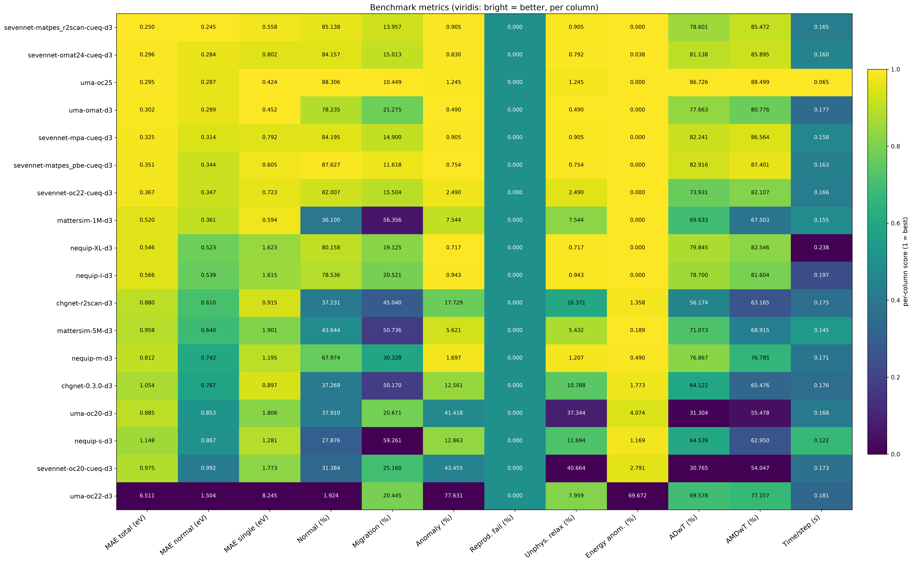

### 単一指標ランキング（棒グラフ）

MAE_total / MAE_normal / Time per step を **良い順（小さいほど上）** に並べた横棒グラフです。
viridis カラーバーで、**明るいほど高性能（低い値）** を表します。

> 棒グラフと下の散布図では、軸が極端に潰れて見にくくなるのを避けるため、外れ値の
> **`uma-oc22-d3`（MAE_total = 6.511 eV）を除外**しています（ヒートマップ・サマリ表・
> 各 calculator の parity 図には含まれます）。

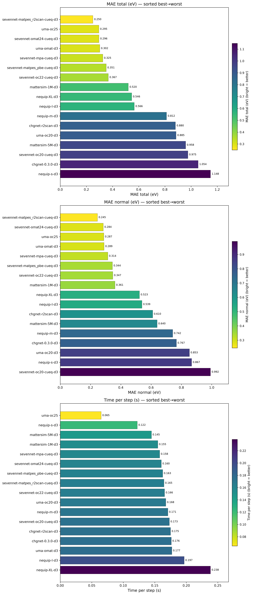

### Pareto 散布図（精度・頑健性 vs 計算コスト）

左から「Time/step vs MAE_total」「Time/step vs MAE_normal」「Time/step vs Normal rate」。
**左下（低コスト・低 MAE）** ほど精度効率が良く、Normal rate は **左上** ほど頑健かつ高速です。
点の色は MAE_total（明るいほど低 MAE＝良い）。

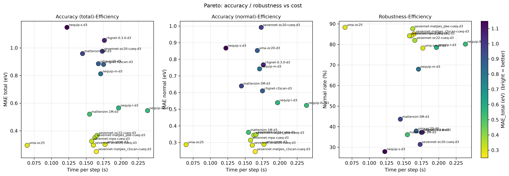

### サマリ表（MAE_normal 昇順）

| # | MLIP | MAE_total (eV) | MAE_normal (eV) | Normal (%) | ADwT (%) | AMDwT (%) | Time/step (s) |
|---:|---|---:|---:|---:|---:|---:|---:|
| 1 | sevennet-matpes_r2scan-cueq-d3 | 0.250 | 0.245 | 85.138 | 78.601 | 85.472 | 0.165 |
| 2 | sevennet-omat24-cueq-d3 | 0.296 | 0.284 | 84.157 | 81.138 | 85.895 | 0.160 |
| 3 | uma-oc25 | 0.295 | 0.287 | 88.306 | 86.726 | 88.499 | 0.065 |
| 4 | uma-omat-d3 | 0.302 | 0.289 | 78.235 | 77.663 | 80.776 | 0.177 |
| 5 | sevennet-mpa-cueq-d3 | 0.325 | 0.314 | 84.195 | 82.241 | 86.564 | 0.158 |
| 6 | sevennet-matpes_pbe-cueq-d3 | 0.351 | 0.344 | 87.627 | 82.916 | 87.401 | 0.163 |
| 7 | sevennet-oc22-cueq-d3 | 0.367 | 0.347 | 82.007 | 73.931 | 82.107 | 0.166 |
| 8 | mattersim-1M-d3 | 0.520 | 0.361 | 36.100 | 69.633 | 67.503 | 0.155 |
| 9 | nequip-XL-d3 | 0.546 | 0.523 | 80.158 | 79.845 | 82.546 | 0.238 |
| 10 | nequip-l-d3 | 0.566 | 0.539 | 78.536 | 78.700 | 81.604 | 0.197 |
| 11 | chgnet-r2scan-d3 | 0.880 | 0.610 | 37.231 | 56.174 | 63.165 | 0.175 |
| 12 | mattersim-5M-d3 | 0.958 | 0.640 | 43.644 | 71.073 | 68.915 | 0.145 |
| 13 | nequip-m-d3 | 0.812 | 0.742 | 67.974 | 76.867 | 76.785 | 0.171 |
| 14 | chgnet-0.3.0-d3 | 1.054 | 0.767 | 37.269 | 64.122 | 65.476 | 0.176 |
| 15 | uma-oc20-d3 | 0.885 | 0.853 | 37.910 | 31.304 | 55.478 | 0.168 |
| 16 | nequip-s-d3 | 1.148 | 0.867 | 27.876 | 64.539 | 62.950 | 0.122 |
| 17 | sevennet-oc20-cueq-d3 | 0.975 | 0.992 | 31.384 | 30.765 | 54.047 | 0.173 |
| 18 | uma-oc22-d3 | 6.511 | 1.504 | 1.924 | 69.578 | 77.157 | 0.181 |

### 主な結果

- **最高精度**: `sevennet-matpes_r2scan-cueq-d3`（MAE_normal = 0.245 eV, MAE_total = 0.250 eV）。
  続いて `sevennet-omat24-cueq-d3`（0.284 eV）, `uma-oc25`（0.287 eV）, `uma-omat-d3`（0.289 eV）。
- **最低精度**: `uma-oc22-d3`（MAE_normal = 1.504 eV, MAE_total は 6.511 eV と外れが大きく、
  Normal rate も 1.9% と大半が anomaly 判定）。OC22 task はこの分子吸着系には不適合。
- **最速**: `uma-oc25`（0.065 s/step）。精度上位（3 位）かつ最速で、本データセットでは
  バランスが最も良い。他は概ね 0.12–0.24 s/step。
- **頑健性（Normal rate）**: 上位の SevenNet 各 modal（cueq-d3）や `uma-oc25`/`nequip-XL/l-d3` は
  78–88% と高い一方、`mattersim`・`chgnet`・`uma-oc20/oc22-d3`・`sevennet-oc20-cueq-d3`・
  `nequip-s-d3` は Normal rate が 30–44% 前後に低下しており、芳香族など大きな分子では
  非物理緩和・エネルギー異常が増える傾向が見られる。
- **modal/task 依存**: 同じ SevenNet でも `matpes_r2scan` / `omat24` / `mpa` / `matpes_pbe` は
  良好（MAE_normal 0.24–0.34 eV）だが、`oc20` は大きく劣化（0.992 eV）。UMA も `omat`/`oc25` が
  良く `oc20`/`oc22` が悪い。**多様体（OMat/MPtrj 系）で学習した modal/task が、官能基分子の
  吸着に対しても汎化しやすい**ことを示唆する。
- 全 calculator に D3 分散力補正を入れた条件での比較であり、芳香環やヘテロ原子を含む
  大きな吸着分子では分散の寄与が無視できないことを踏まえた評価になっている。

## 各計算機の詳細 parity 図（予測 vs DFT）

左 = Total（全反応）, 右 = Normal（anomaly/migration 除外）。点は**官能基系**で色分け、
破線は y=x。Normal/anomaly の分類は CatBench 本体の分類器に準拠しています。
（MAE_normal 昇順）

### 1. sevennet-matpes_r2scan-cueq-d3

MAE_total = 0.250 eV / MAE_normal = 0.245 eV / Normal = 85.138 %

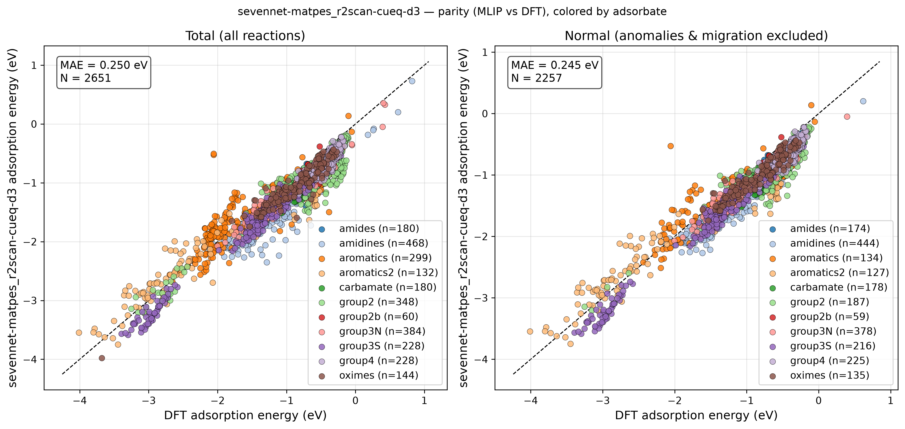

### 2. sevennet-omat24-cueq-d3

MAE_total = 0.296 eV / MAE_normal = 0.284 eV / Normal = 84.157 %

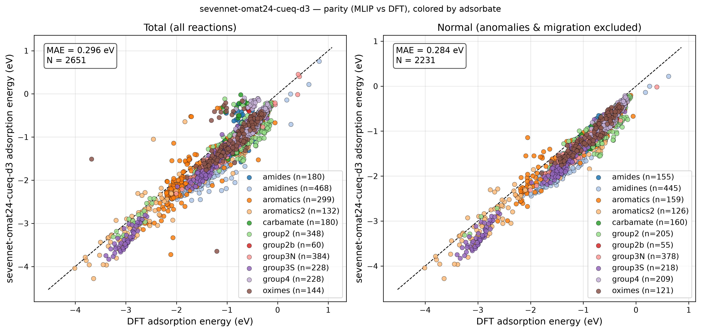

### 3. uma-oc25

MAE_total = 0.295 eV / MAE_normal = 0.287 eV / Normal = 88.306 %

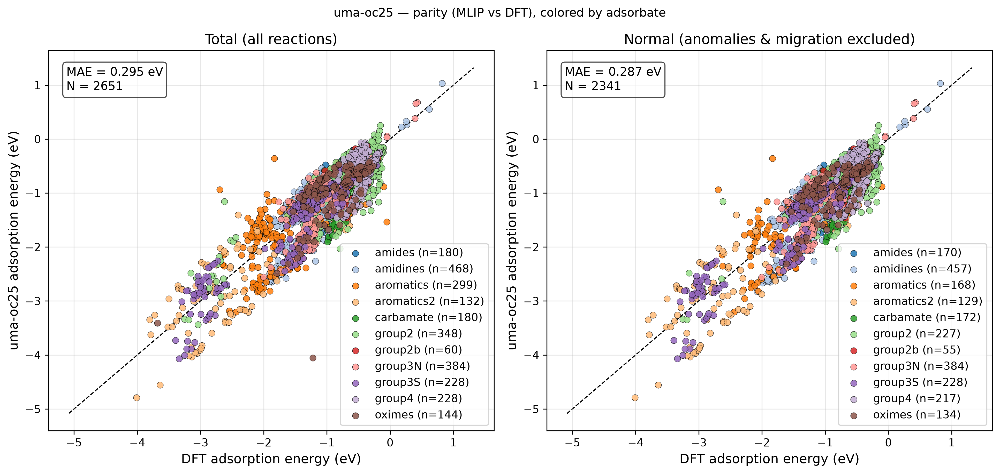

### 4. uma-omat-d3

MAE_total = 0.302 eV / MAE_normal = 0.289 eV / Normal = 78.235 %

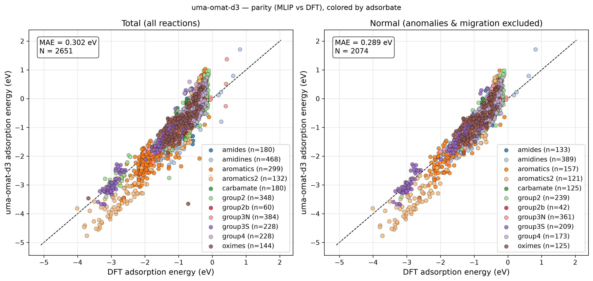

### 5. sevennet-mpa-cueq-d3

MAE_total = 0.325 eV / MAE_normal = 0.314 eV / Normal = 84.195 %

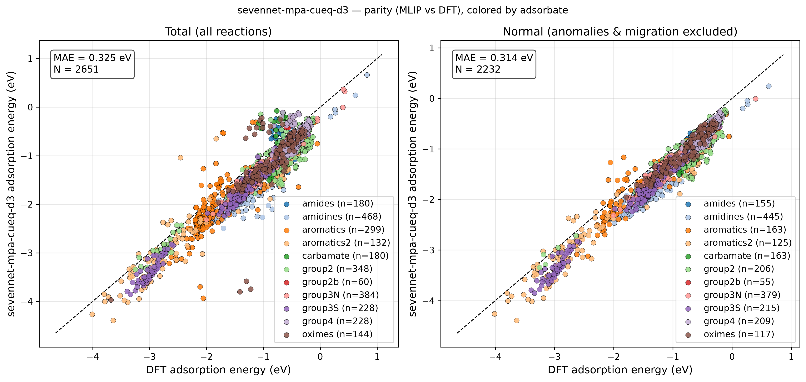

### 6. sevennet-matpes_pbe-cueq-d3

MAE_total = 0.351 eV / MAE_normal = 0.344 eV / Normal = 87.627 %

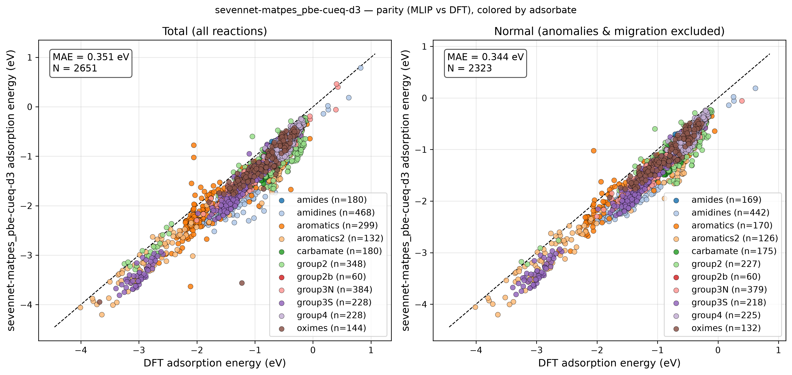

### 7. sevennet-oc22-cueq-d3

MAE_total = 0.367 eV / MAE_normal = 0.347 eV / Normal = 82.007 %

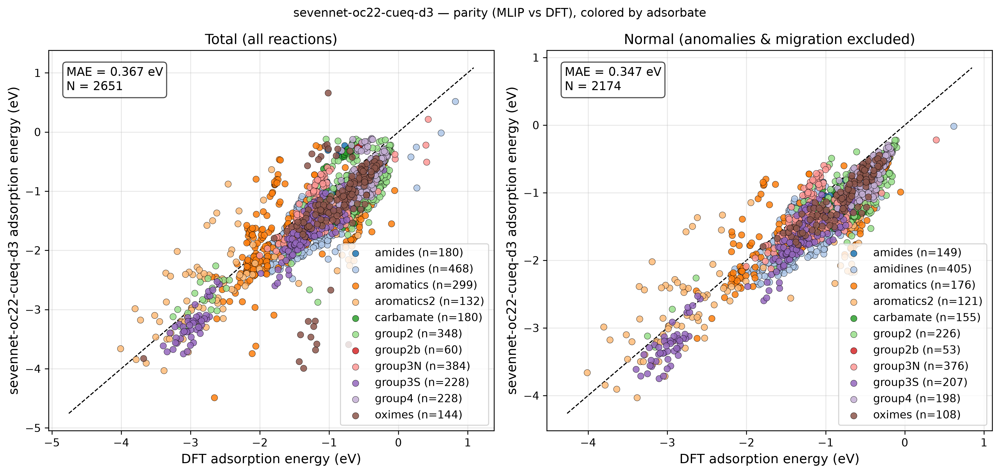

### 8. mattersim-1M-d3

MAE_total = 0.520 eV / MAE_normal = 0.361 eV / Normal = 36.100 %

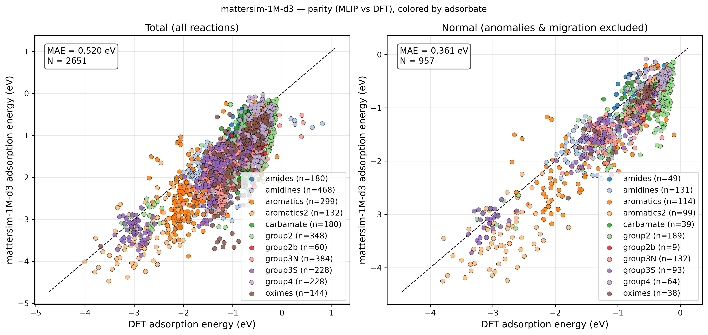

### 9. nequip-XL-d3

MAE_total = 0.546 eV / MAE_normal = 0.523 eV / Normal = 80.158 %

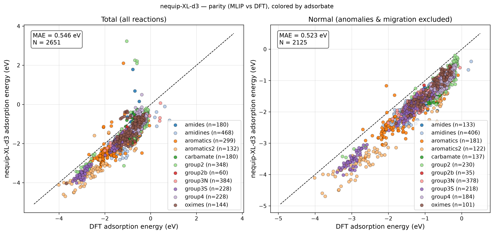

### 10. nequip-l-d3

MAE_total = 0.566 eV / MAE_normal = 0.539 eV / Normal = 78.536 %

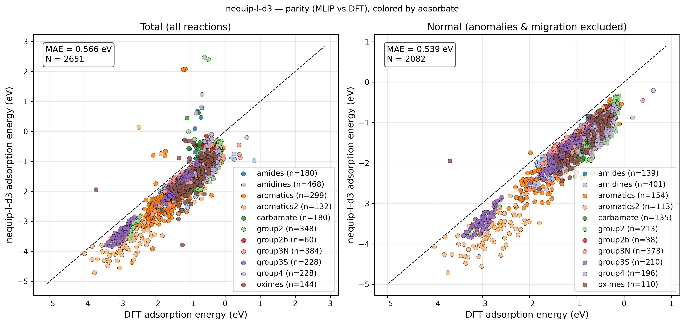

### 11. chgnet-r2scan-d3

MAE_total = 0.880 eV / MAE_normal = 0.610 eV / Normal = 37.231 %

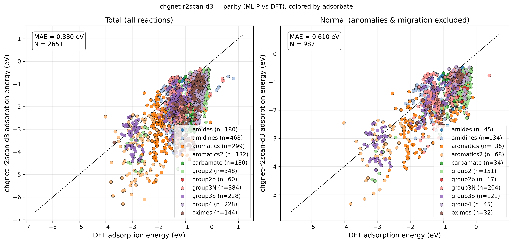

### 12. mattersim-5M-d3

MAE_total = 0.958 eV / MAE_normal = 0.640 eV / Normal = 43.644 %

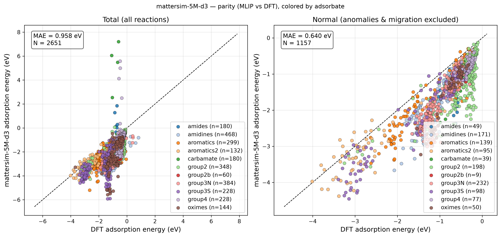

### 13. nequip-m-d3

MAE_total = 0.812 eV / MAE_normal = 0.742 eV / Normal = 67.974 %

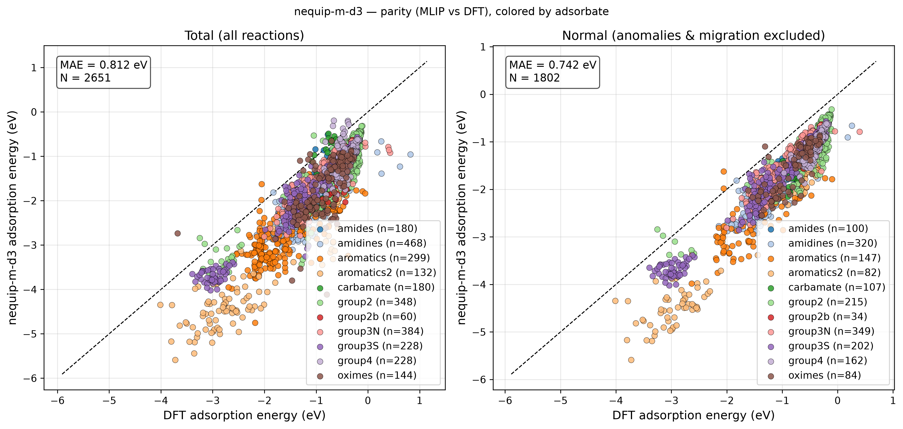

### 14. chgnet-0.3.0-d3

MAE_total = 1.054 eV / MAE_normal = 0.767 eV / Normal = 37.269 %

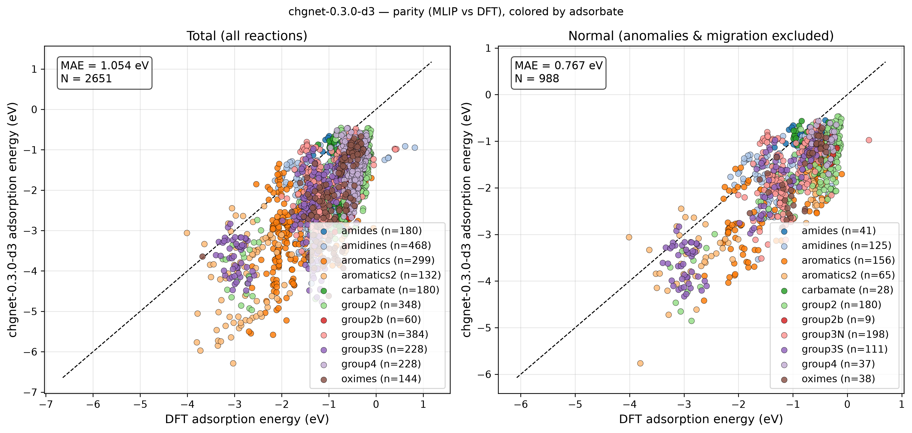

### 15. uma-oc20-d3

MAE_total = 0.885 eV / MAE_normal = 0.853 eV / Normal = 37.910 %

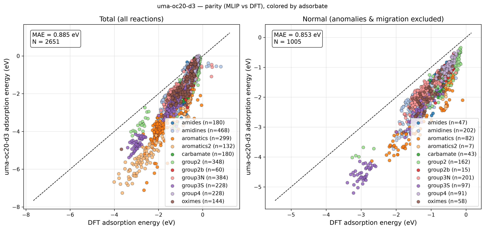

### 16. nequip-s-d3

MAE_total = 1.148 eV / MAE_normal = 0.867 eV / Normal = 27.876 %

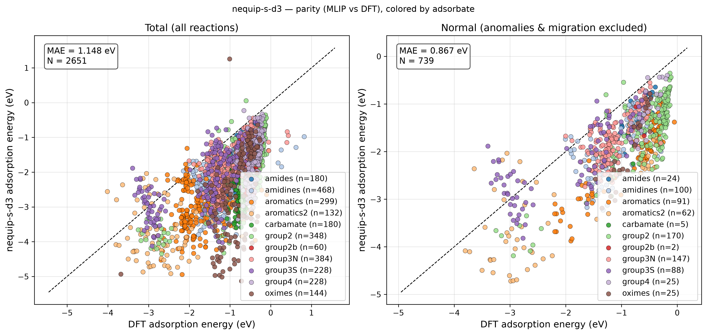

### 17. sevennet-oc20-cueq-d3

MAE_total = 0.975 eV / MAE_normal = 0.992 eV / Normal = 31.384 %

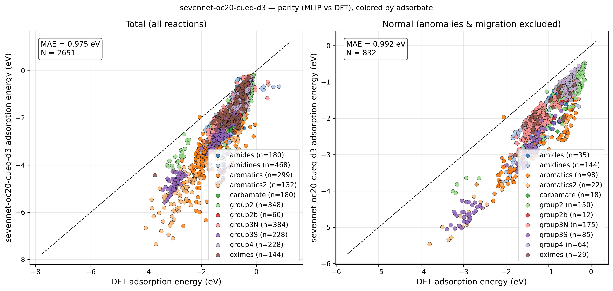

### 18. uma-oc22-d3

MAE_total = 6.511 eV / MAE_normal = 1.504 eV / Normal = 1.924 %

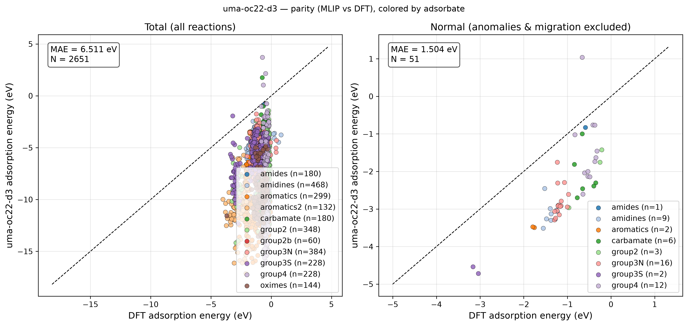
