# MamunHighT2019 — MLIP Adsorption-Energy Benchmark Results

**English** | [日本語](README_jp.md)

## Benchmark overview

**MamunHighT2019** is a large-scale benchmark of DFT reference adsorption energies for
**small-molecule adsorption** on **2,035 binary-alloy surfaces**, with **45,130 reactions**
in total (reaction key example: `Ag12_CH4(g) - H2(g) + * -> CH2*` = `<slab>_<gas-phase reaction> -> <adsorbate>*`;
source: [CatBench](https://catbench.org/?dataset=MamunHighT2019) / Zenodo).
The adsorbates are **C / H / N / O / S small-molecule fragments** (CH\*, CH2\*, CH3\*, NH\*,
OH\*, SH\*, etc.). This page compares the adsorption energies predicted by machine-learning
interatomic potentials (MLIPs) against DFT, evaluating accuracy, robustness, and compute
cost (**21 calculator/variants completed so far** are compared).

- Calculators compared: UMA (fairchem), SevenNet (7net-omni, each modal), MatterSim, CHGNet, NequIP-OAM
- A trailing **`-cueq`** is SevenNet's **CuEquivariance** accelerated build (the model
  itself is identical, so accuracy is the same but inference is faster)
- This run has **no dispersion correction** (small molecules on metal surfaces; a separate
  axis from the `-d3` FG_dataset)
- Settings: `mode=basic` (structure relaxation, LBFGS), `n_seeds=3`, `f_crit_relax=0.05`, `n_crit_relax=999`
- **`nequip-l` / `nequip-XL` are still computing** and are not yet included here (they
  have been resubmitted; the analysis will be regenerated once they finish)

### Meaning of the metrics

| Metric | Description |
|---|---|
| MAE_total (eV) | Mean absolute error of predicted vs DFT adsorption energy over all reactions |
| MAE_normal (eV) | MAE over normal reactions only (anomalies and adsorbate migration excluded) |
| Normal rate (%) | Fraction of reactions classified as normal (higher = more robust) |
| Anomaly rate (%) | Fraction with energy anomaly / unphysical relaxation / reproduction failure (lower = better) |
| ADwT / AMDwT (%) | Fraction of predictions within threshold (higher = better) |
| Time per step (s) | Compute time per optimization step (lower = faster) |

## Overall comparison

### Metric heatmap table

Each column is normalized independently with viridis so that **brighter (yellow) =
higher performance** (metrics where smaller is better, such as MAE and time, are
inverted). Each cell shows the raw value.

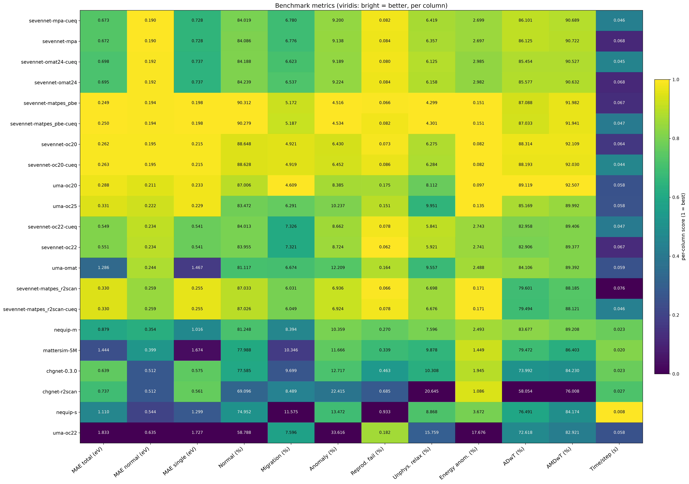

### Single-metric ranking (bar charts)

Horizontal bars for MAE_total / MAE_normal / Time per step, **sorted best-first
(smaller = higher)**. The viridis colorbar means **brighter = higher performance
(lower value)**. (This dataset has no prominent outlier, so all 21 are shown.)

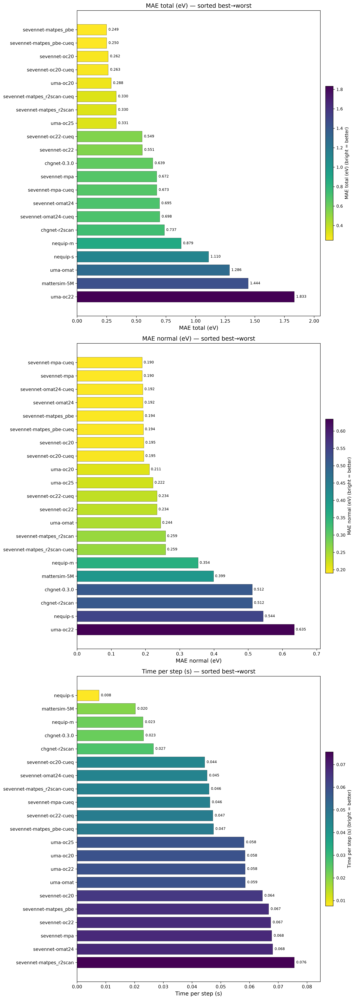

### Pareto scatter (accuracy / robustness vs compute cost)

From left: "Time/step vs MAE_total", "Time/step vs MAE_normal", "Time/step vs
Normal rate". **Lower-left (low cost, low MAE)** means better accuracy-efficiency;
for Normal rate, **upper-left** is more robust and faster. Point color is MAE_total
(brighter = lower MAE = better).

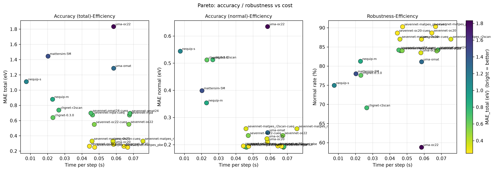

### Summary table (ascending MAE_normal)

| # | MLIP | MAE_total (eV) | MAE_normal (eV) | Normal (%) | ADwT (%) | AMDwT (%) | Time/step (s) |
|---:|---|---:|---:|---:|---:|---:|---:|
| 1 | sevennet-mpa-cueq | 0.673 | 0.190 | 84.019 | 86.101 | 90.689 | 0.046 |
| 2 | sevennet-mpa | 0.672 | 0.190 | 84.086 | 86.125 | 90.722 | 0.068 |
| 3 | sevennet-omat24-cueq | 0.698 | 0.192 | 84.188 | 85.454 | 90.527 | 0.045 |
| 4 | sevennet-omat24 | 0.695 | 0.192 | 84.239 | 85.577 | 90.632 | 0.068 |
| 5 | sevennet-matpes_pbe | 0.249 | 0.194 | 90.312 | 87.088 | 91.982 | 0.067 |
| 6 | sevennet-matpes_pbe-cueq | 0.250 | 0.194 | 90.279 | 87.033 | 91.941 | 0.047 |
| 7 | sevennet-oc20 | 0.262 | 0.195 | 88.648 | 88.314 | 92.109 | 0.064 |
| 8 | sevennet-oc20-cueq | 0.263 | 0.195 | 88.628 | 88.193 | 92.030 | 0.044 |
| 9 | uma-oc20 | 0.288 | 0.211 | 87.006 | 89.119 | 92.507 | 0.058 |
| 10 | uma-oc25 | 0.331 | 0.222 | 83.472 | 85.169 | 89.992 | 0.058 |
| 11 | sevennet-oc22-cueq | 0.549 | 0.234 | 84.013 | 82.958 | 89.406 | 0.047 |
| 12 | sevennet-oc22 | 0.551 | 0.234 | 83.955 | 82.906 | 89.377 | 0.067 |
| 13 | uma-omat | 1.286 | 0.244 | 81.117 | 84.106 | 89.392 | 0.059 |
| 14 | sevennet-matpes_r2scan | 0.330 | 0.259 | 87.033 | 79.601 | 88.185 | 0.076 |
| 15 | sevennet-matpes_r2scan-cueq | 0.330 | 0.259 | 87.026 | 79.494 | 88.121 | 0.046 |
| 16 | nequip-m | 0.879 | 0.354 | 81.248 | 83.677 | 89.208 | 0.023 |
| 17 | mattersim-5M | 1.444 | 0.399 | 77.988 | 79.472 | 86.403 | 0.020 |
| 18 | chgnet-0.3.0 | 0.639 | 0.512 | 77.585 | 73.992 | 84.230 | 0.023 |
| 19 | chgnet-r2scan | 0.737 | 0.512 | 69.096 | 58.054 | 76.008 | 0.027 |
| 20 | nequip-s | 1.110 | 0.544 | 74.952 | 76.491 | 84.174 | 0.008 |
| 21 | uma-oc22 | 1.833 | 0.635 | 58.788 | 72.618 | 82.921 | 0.058 |

### Key findings

- **Best accuracy (Normal)**: `sevennet-mpa`(-cueq) (MAE_normal = 0.190 eV). The top
  group is SevenNet's modals (mpa / omat24 / matpes_pbe / oc20) tightly clustered at
  0.19–0.20 eV, followed by `uma-oc20` (0.211 eV).
- **Best accuracy (Total)**: `sevennet-matpes_pbe` (MAE_total = 0.249 eV, and also the
  highest Normal rate at 90.3%). On MAE_total, the matpes_pbe / oc20 family beats the
  mpa/omat24 family (0.67–0.70 eV), showing that **for the overall picture including
  anomalies, the matpes_pbe / oc20 modals are more robust**.
- **Worst accuracy**: `uma-oc22` (MAE_normal = 0.635 eV, MAE_total = 1.833 eV, Normal
  rate 58.8%). The OC22 task does not fit this alloy × small-molecule system.
- **Fastest**: `nequip-s` (0.008 s/step), then `mattersim-5M` (0.020) and
  `nequip-m` / `chgnet-0.3.0` (0.023). Their accuracy is mid-tier or below, however, so
  **for the accuracy-speed balance `sevennet-*-cueq` is excellent** (0.044–0.047 s/step
  at MAE_normal 0.19–0.26 eV).
- **Effect of CuEquivariance**: accuracy essentially unchanged, inference faster
  (e.g. `sevennet-mpa` 0.068s → `sevennet-mpa-cueq` 0.046s; `sevennet-oc20` 0.064s →
  `sevennet-oc20-cueq` 0.044s; MAE identical). The effect is larger on large datasets.
- **modal/task dependence and O\* anomalies**: on normal reactions (MAE_normal),
  SevenNet's mpa / omat24 / matpes_pbe / oc20 are tightly clustered at 0.19–0.20 eV.
  On MAE_total, however, **modals/tasks whose training data / task / head include the
  Hubbard +U correction tend to show more metal-surface O\* anomalies**, degrading the
  total. Concretely, `mpa` (MPtrj) and `omat24` (OMat24), which come from Materials
  Project-type (PBE+U-mixed) data, break down on O\* and their MAE_total worsens to
  0.67–0.70 eV, whereas the U-free `matpes_pbe` (MatPES) and `oc20` (OC20 / metal
  surfaces) keep O\* stable and reach the lowest MAE_total (matpes_pbe 0.249 eV). UMA is
  likewise mid-to-upper on oc20/oc25/omat, but `oc22` does not fit this alloy ×
  small-molecule system and is last. For the detailed discussion of this "+U-derived
  PBE/PBE+U PES mixing and metal-surface O\* anomalies" and the paper citations
  (arXiv:2510.11241 / arXiv:2601.21056), see the [overview](../README.md).

## Per-calculator parity plots (prediction vs DFT)

Left = Total (all reactions), right = Normal (anomalies/migration excluded). Points
are colored by **adsorbate**; the dashed line is y=x. The Normal/anomaly classification
follows CatBench's own classifier. (Ascending MAE_normal.)

### 1. sevennet-mpa-cueq

MAE_total = 0.673 eV / MAE_normal = 0.190 eV / Normal = 84.019 %

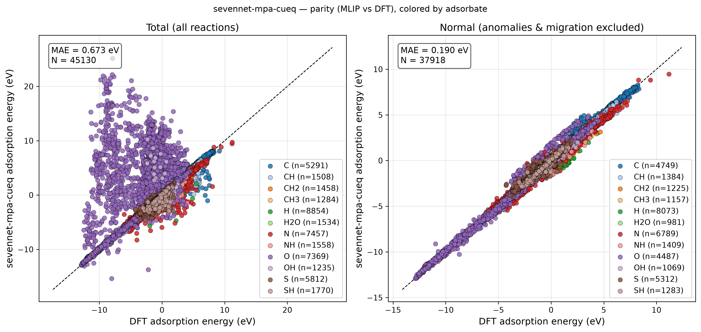

### 2. sevennet-mpa

MAE_total = 0.672 eV / MAE_normal = 0.190 eV / Normal = 84.086 %

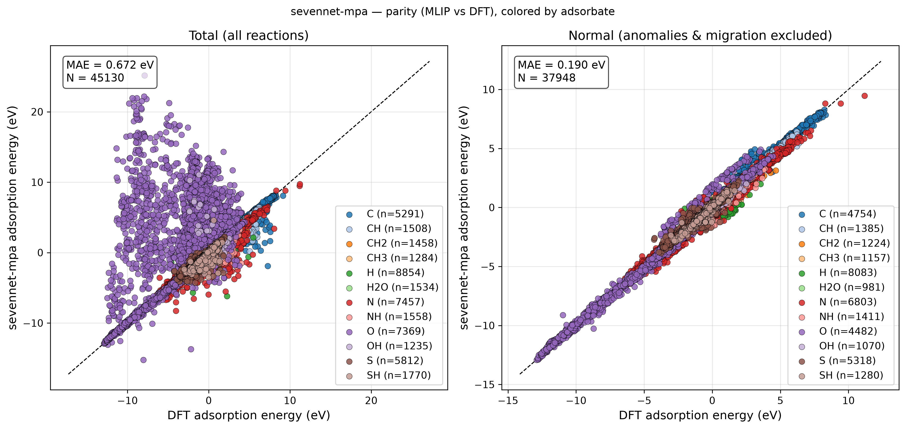

### 3. sevennet-omat24-cueq

MAE_total = 0.698 eV / MAE_normal = 0.192 eV / Normal = 84.188 %

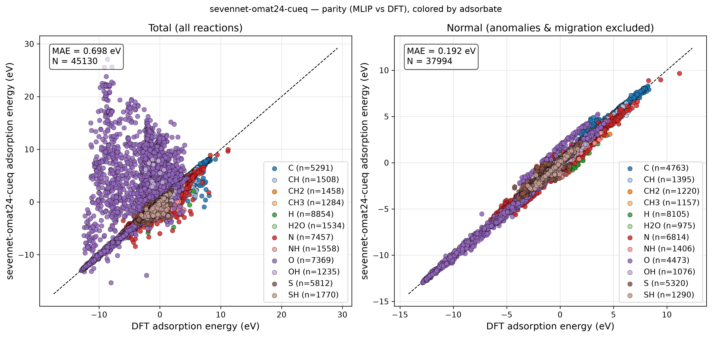

### 4. sevennet-omat24

MAE_total = 0.695 eV / MAE_normal = 0.192 eV / Normal = 84.239 %

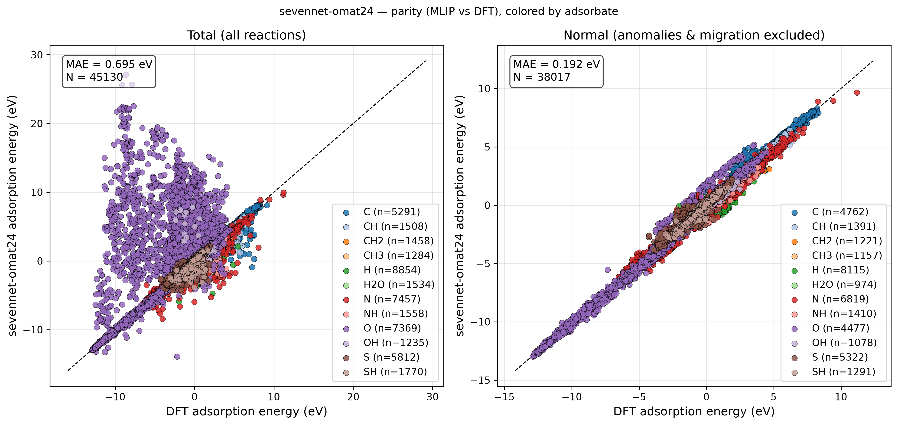

### 5. sevennet-matpes_pbe

MAE_total = 0.249 eV / MAE_normal = 0.194 eV / Normal = 90.312 %

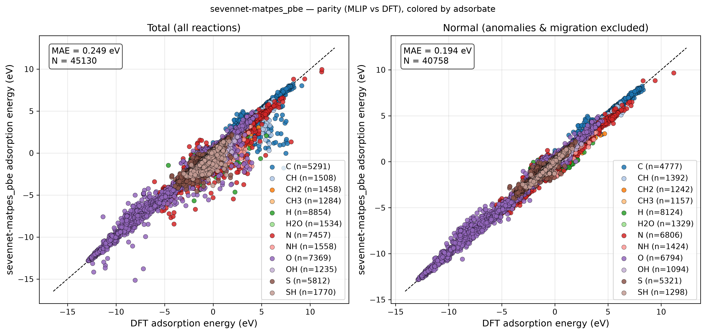

### 6. sevennet-matpes_pbe-cueq

MAE_total = 0.250 eV / MAE_normal = 0.194 eV / Normal = 90.279 %

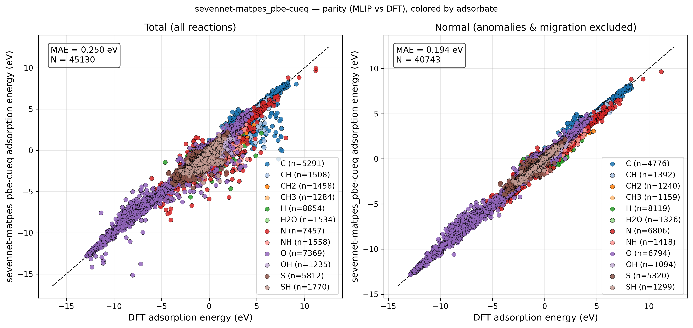

### 7. sevennet-oc20

MAE_total = 0.262 eV / MAE_normal = 0.195 eV / Normal = 88.648 %

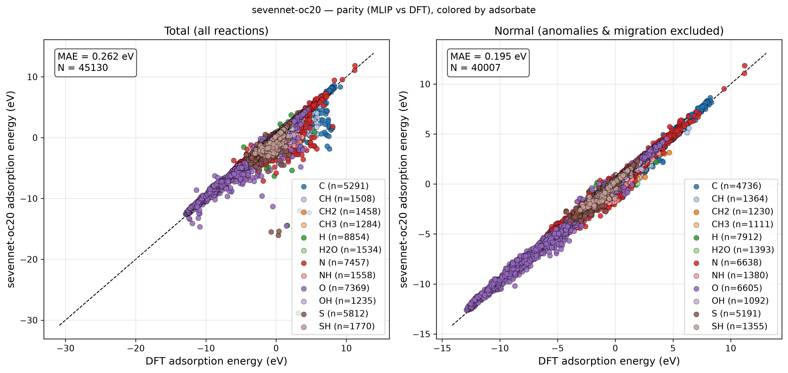

### 8. sevennet-oc20-cueq

MAE_total = 0.263 eV / MAE_normal = 0.195 eV / Normal = 88.628 %

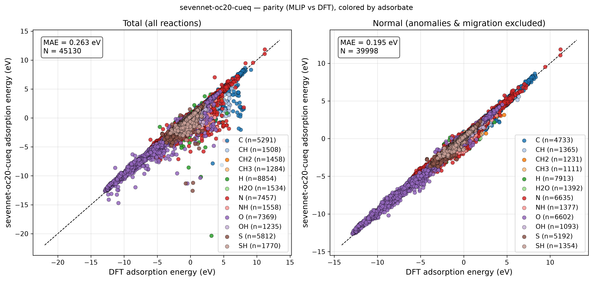

### 9. uma-oc20

MAE_total = 0.288 eV / MAE_normal = 0.211 eV / Normal = 87.006 %

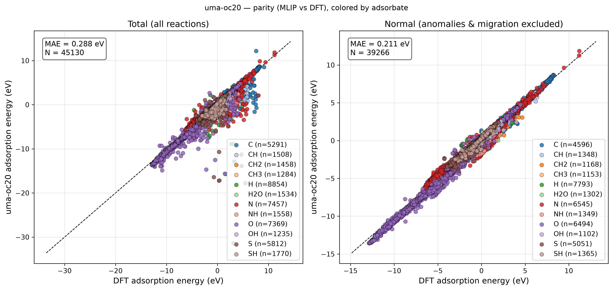

### 10. uma-oc25

MAE_total = 0.331 eV / MAE_normal = 0.222 eV / Normal = 83.472 %

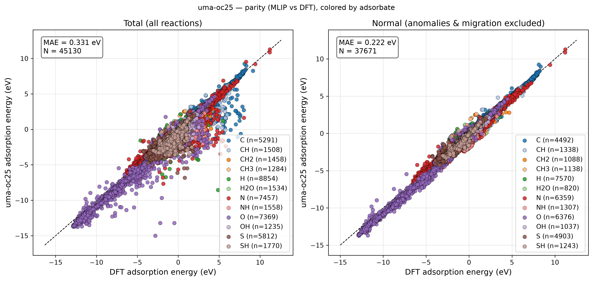

### 11. sevennet-oc22-cueq

MAE_total = 0.549 eV / MAE_normal = 0.234 eV / Normal = 84.013 %

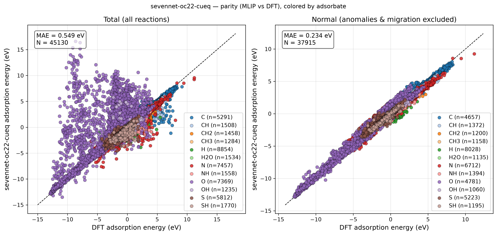

### 12. sevennet-oc22

MAE_total = 0.551 eV / MAE_normal = 0.234 eV / Normal = 83.955 %

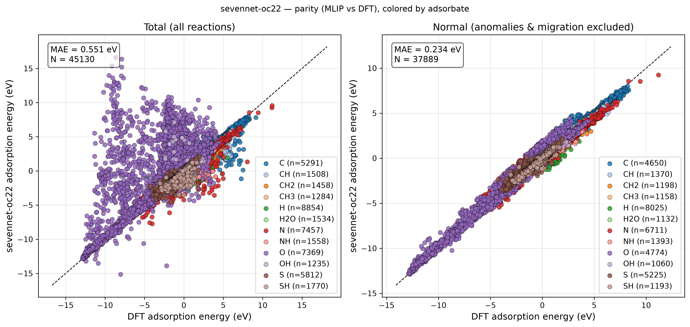

### 13. uma-omat

MAE_total = 1.286 eV / MAE_normal = 0.244 eV / Normal = 81.117 %

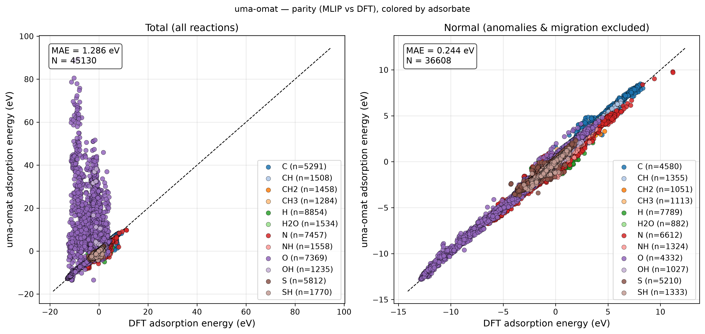

### 14. sevennet-matpes_r2scan

MAE_total = 0.330 eV / MAE_normal = 0.259 eV / Normal = 87.033 %

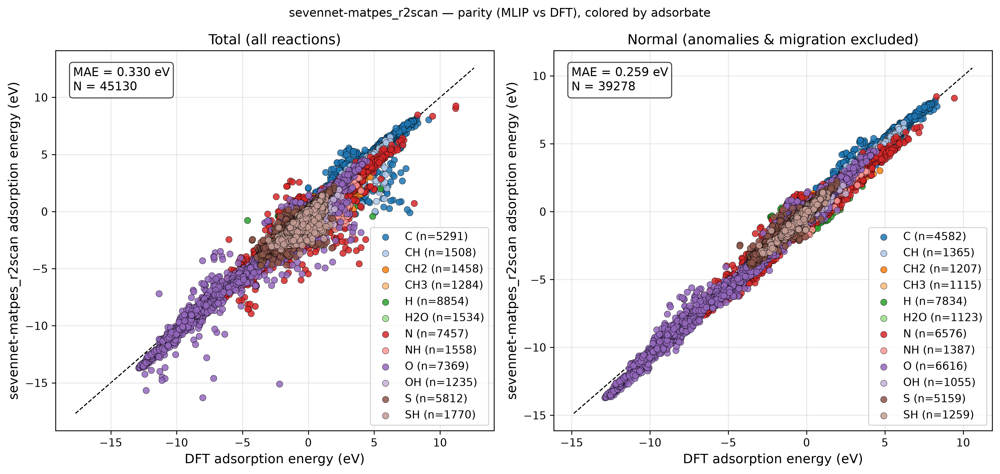

### 15. sevennet-matpes_r2scan-cueq

MAE_total = 0.330 eV / MAE_normal = 0.259 eV / Normal = 87.026 %

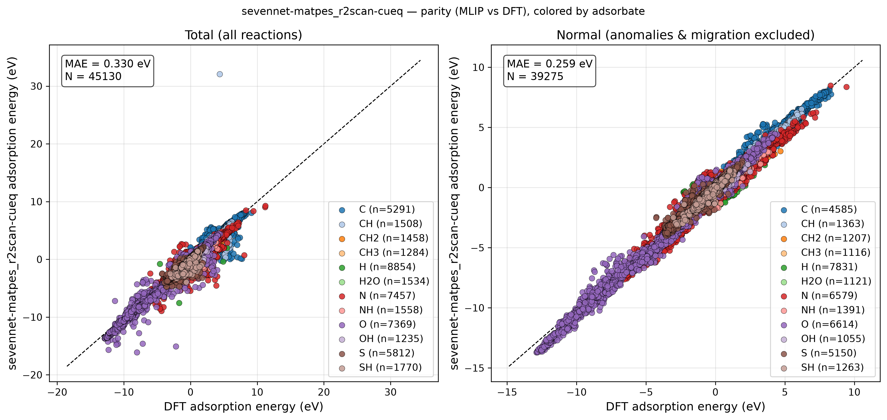

### 16. nequip-m

MAE_total = 0.879 eV / MAE_normal = 0.354 eV / Normal = 81.248 %

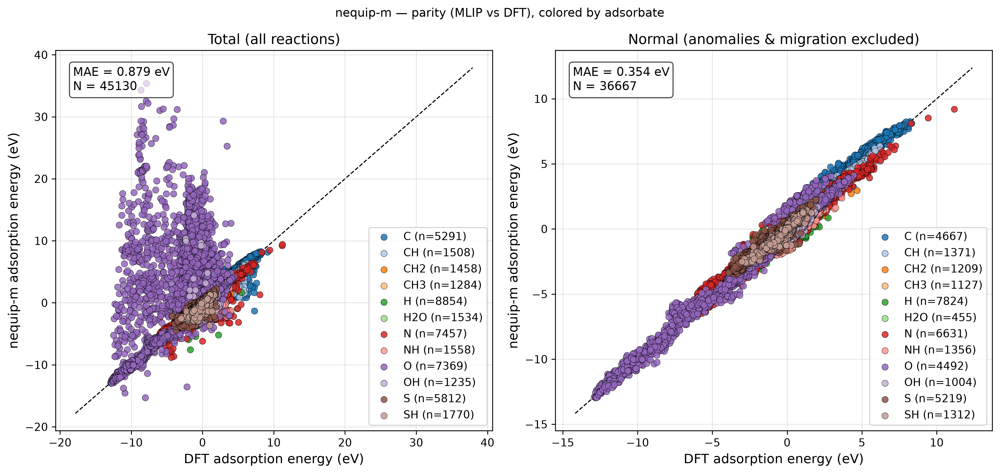

### 17. mattersim-5M

MAE_total = 1.444 eV / MAE_normal = 0.399 eV / Normal = 77.988 %

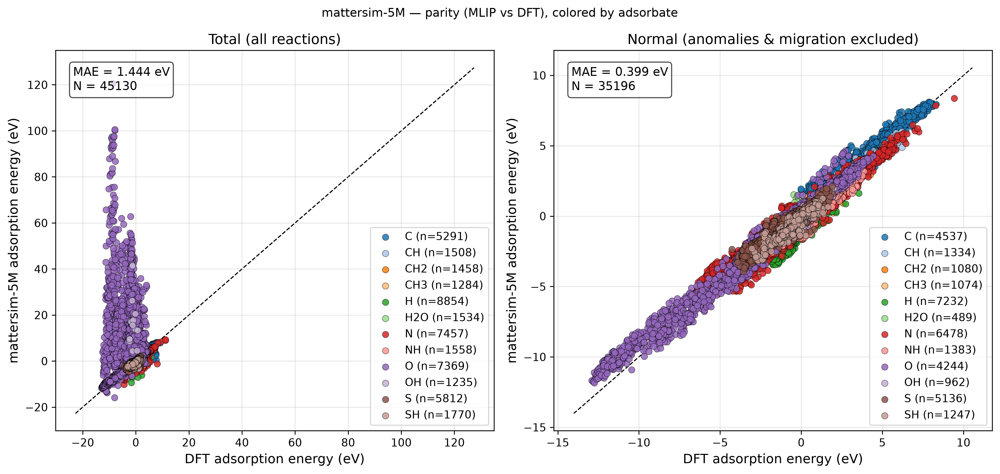

### 18. chgnet-0.3.0

MAE_total = 0.639 eV / MAE_normal = 0.512 eV / Normal = 77.585 %

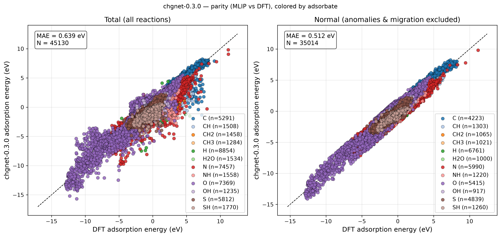

### 19. chgnet-r2scan

MAE_total = 0.737 eV / MAE_normal = 0.512 eV / Normal = 69.096 %

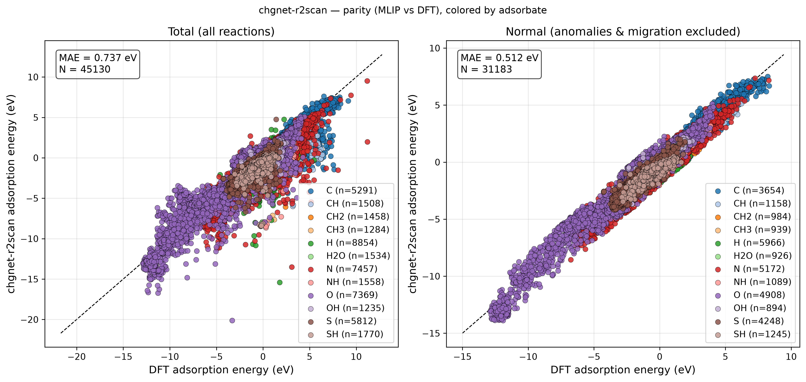

### 20. nequip-s

MAE_total = 1.110 eV / MAE_normal = 0.544 eV / Normal = 74.952 %

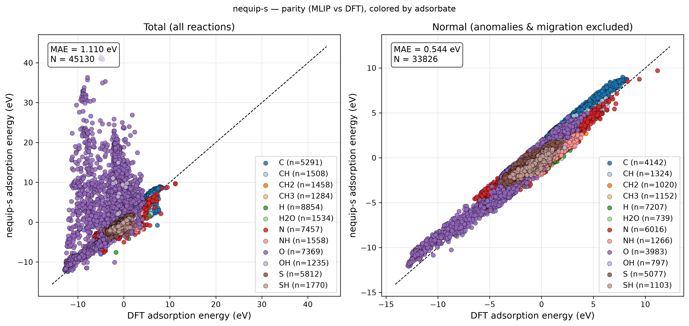

### 21. uma-oc22

MAE_total = 1.833 eV / MAE_normal = 0.635 eV / Normal = 58.788 %

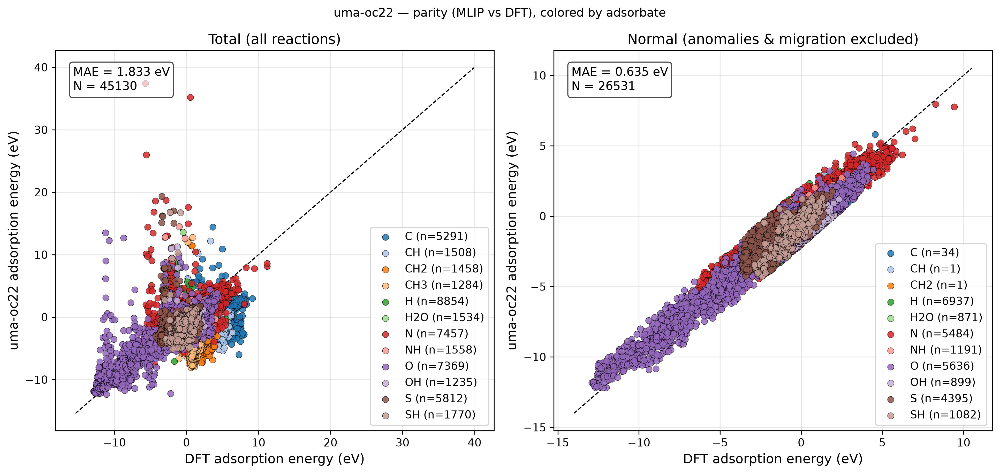
